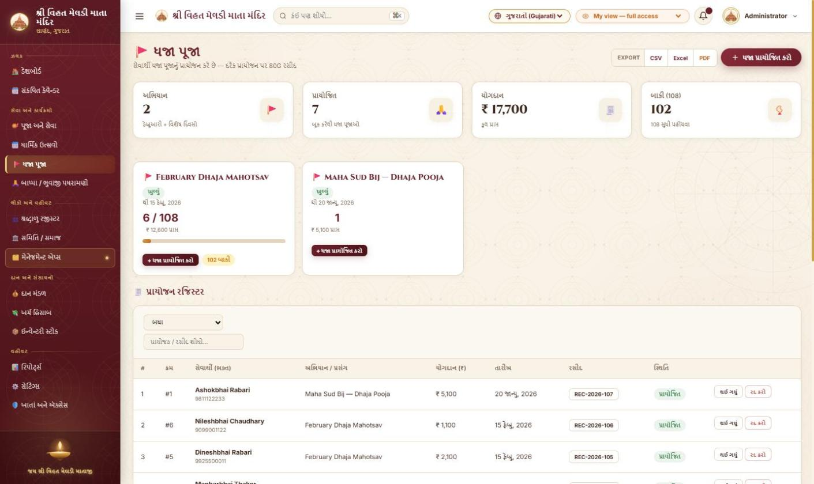
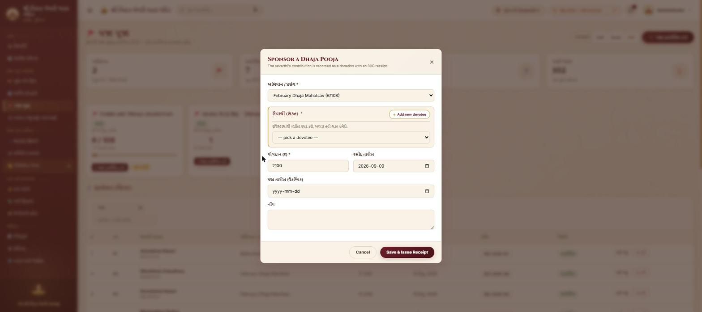
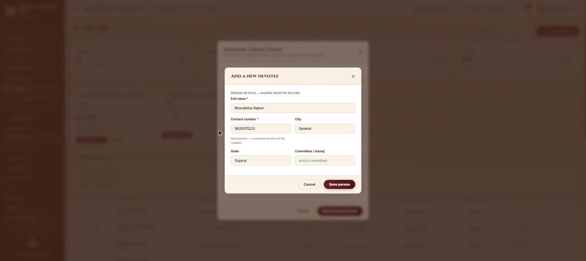
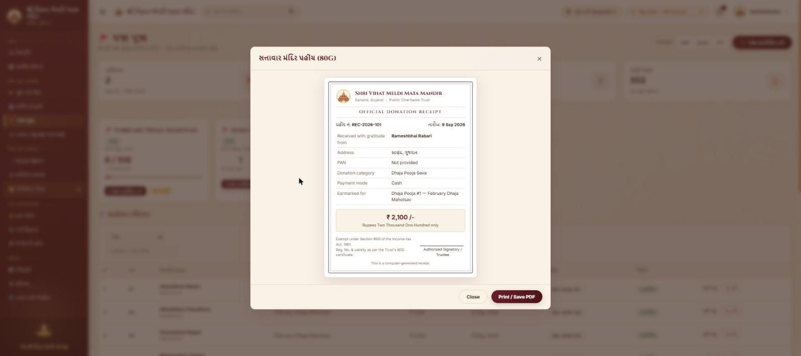
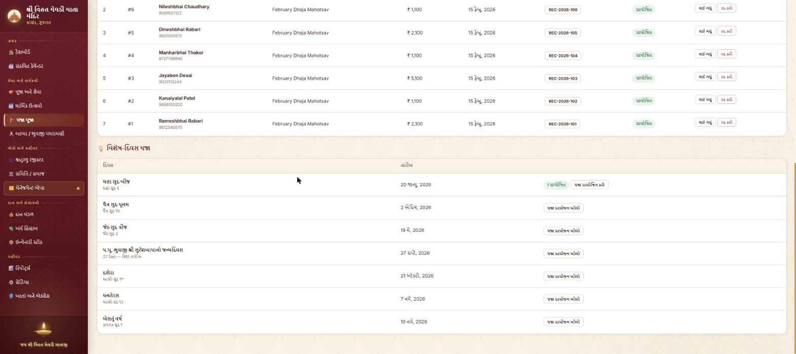
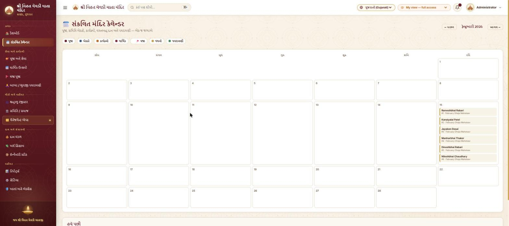

# ધજા પૂજા — વપરાશ માર્ગદર્શિકા (ગુજરાતી)

> આ દસ્તાવેજ **એપ્લિકેશનની બહાર**નો છે — ફક્ત સંદર્ભ માટે. ધજા પૂજા મોડ્યુલ કેવી
> રીતે કામ કરે છે અને તેને કેવી રીતે વાપરવું તે અહીં સ્ક્રીનશોટ સાથે સમજાવ્યું છે.

---

## 1. ધજા પૂજા શું છે?

મંદિરમાં **ધજા (ધ્વજ) પૂજા** નો કાર્યક્રમ ચાલે છે. તેમાં:

- એક **સેવાર્થી (ભક્ત)** ધજા પૂજાનું **પ્રાયોજન** કરે છે અને એક **યોગદાન (દાન)**
  આપે છે. તેની સામે તેને **80G રસીદ** મળે છે.
- **ફેબ્રુઆરીમાં** કુલ **108 ધજા પૂજા** થાય છે — આ એક *અભિયાન* છે જે 108 પર
  પહોંચતાં આપોઆપ *બંધ* થઈ જાય છે.
- ફેબ્રુઆરી પછી ધજા પૂજા **વિશેષ તિથિઓ / મહત્વના દિવસો** પર થાય છે (દા.ત. મહા
  સુદ બીજ / "માતાજીની ધજા", ચૈત્ર સુદ પૂનમ, દશેરા...). દરેક વિશેષ દિવસ માટે
  અલગ અભિયાન ખોલી શકાય છે.

આ મોડ્યુલ પોર્ટલમાં પહેલેથી હાજર **દાન (Donations)**, **ભક્ત રજિસ્ટર (Devotees)**,
**વાર્ષિક પ્રસંગો (Annual Events)**, **કેલેન્ડર** અને **રિમાઇન્ડર** સાથે જોડાયેલું
છે — કોઈ અલગ "ટાપુ" નથી.

---

## 2. મુખ્ય ખ્યાલો

| શબ્દ | અર્થ |
|---|---|
| **અભિયાન (Campaign)** | ધજા પૂજાનો એક સમૂહ. ફેબ્રુઆરીના અભિયાનનું *લક્ષ્ય = 108*. વિશેષ-દિવસના અભિયાનનું લક્ષ્ય 0 (અમર્યાદિત). |
| **પ્રાયોજન (Sponsorship)** | એક સેવાર્થી દ્વારા એક ધજા પૂજા બુક કરવી + યોગદાન. રજિસ્ટરમાં એક પંક્તિ. |
| **ક્રમ નંબર (Seq)** | અભિયાનની અંદર 1, 2, 3... — ફેબ્રુઆરીમાં 1 થી 108. પ્રાયોજન રદ થાય તો તે નંબર ફરી ખાલી થાય છે. |
| **સેવાર્થી** | પ્રાયોજન કરનાર વ્યક્તિ. તે હંમેશા **ભક્ત રજિસ્ટર**નો એક ભક્ત (devotee) હોય છે — નામ/મોબાઈલ ફરી-ફરી લખવાની જરૂર નથી. |
| **રસીદ** | પ્રાયોજન સાચવતાં જ સર્વર એક *રોકડ દાન* બનાવે છે ("ધજા પૂજા સેવા" શ્રેણી) અને `REC-2026-###` નંબરની 80G રસીદ આપે છે. |

---

## 3. પાનું ક્યાં છે?

ડાબી બાજુના મેનૂમાં **"સેવા અને કાર્યક્રમો"** જૂથ હેઠળ **🚩 ધજા પૂજા**.
(ફક્ત એડમિન / સુપર-એડમિન માટે દેખાય છે. હિસાબનીશ ને દાનનું આંકડું *દાન* અને
*રિપોર્ટ્સ* પાનાં પર દેખાય જ છે.)

---

## 4. મુખ્ય સ્ક્રીન

ઉપરથી નીચે:

1. **KPI પટ્ટી** — કુલ અભિયાન, કુલ પ્રાયોજિત ધજા, કુલ યોગદાન (₹), અને
   ફેબ્રુઆરીના 108માંથી કેટલા બાકી.
2. **અભિયાન બોર્ડ** — દરેક અભિયાનનું કાર્ડ:
   - મોટો આંકડો `6 / 108` = કેટલા પ્રાયોજિત / લક્ષ્ય
   - સોનેરી પ્રગતિ પટ્ટી
   - `₹ 12,600 પ્રાપ્ત`
   - **+ ધજા પ્રાયોજિત કરો** બટન અને `102 બાકી` બિલ્લો
   - અભિયાન 108 પર પહોંચે એટલે "બંધ" બિલ્લો દેખાય અને પ્રાયોજન બટન છુપાય.
3. **પ્રાયોજન રજિસ્ટર** — બધા પ્રાયોજનની યાદી. સ્થિતિ પ્રમાણે ગાળી શકાય
   (બધા / પ્રાયોજિત / સંપન્ન / રદ) અને પ્રાયોજક કે રસીદ નંબરથી શોધી શકાય.
   દરેક પંક્તિમાં: ક્રમ #, સેવાર્થી, અભિયાન, યોગદાન, તારીખ, **રસીદ બિલ્લો**
   (દબાવતાં રસીદ ખૂલે), સ્થિતિ, અને એડમિન માટે *થઈ ગયું* / *રદ કરો* બટન.
4. **વિશેષ-દિવસ ધજા** — વાર્ષિક પ્રસંગોની યાદી (તારીખ પંચાંગથી ગણાય છે).

---

## 5. ધજા કેવી રીતે પ્રાયોજિત કરવી (પગલાં)

### પગલું 1 — ફોર્મ ખોલો

પાનાં ઉપર જમણે **+ ધજા પ્રાયોજિત કરો**, અથવા કોઈ અભિયાન કાર્ડ પરનું એ જ બટન
દબાવો.

ફોર્મમાં:

| ક્ષેત્ર | નોંધ |
|---|---|
| **અભિયાન / પ્રસંગ** | ખુલ્લાં અભિયાનમાંથી પસંદ કરો. કૌંસમાં `(6/108)` પ્રગતિ દેખાય. |
| **સેવાર્થી (ભક્ત)** | રજિસ્ટરમાંથી વ્યક્તિ પસંદ કરો. નવો હોય તો **Add new devotee** દબાવો (પગલું 2). |
| **યોગદાન (₹)** | રકમ — આ જ રકમની 80G રસીદ બનશે. |
| **રસીદ તારીખ** | ડિફૉલ્ટ = કાર્યકારી તારીખ (working date). રસીદ નંબર આ વર્ષ પ્રમાણે મળે. |
| **ધજા તારીખ (વૈકલ્પિક)** | ધજા ક્યારે ચઢાવવાની છે. ભરો તો કેલેન્ડર અને રિમાઇન્ડરમાં દેખાય. ન ભરો તો અભિયાનની શરૂ-તારીખ વપરાય. |
| **નોંધ** | વૈકલ્પિક. |

**Save & Issue Receipt** દબાવો.

### પગલું 2 — નવો સેવાર્થી ઉમેરવો (જરૂર પડે તો)

આ પોર્ટલનું **સહિયારું ભક્ત ફોર્મ** છે (એ જ ફોર્મ સમિતિ, મેનેજમેન્ટ, પૂજા
બધે વપરાય). પૂરું નામ + મોબાઈલ ફરજિયાત. મોબાઈલ પહેલેથી રજિસ્ટરમાં હોય તો
તે જ ભક્ત ફરી વપરાય — **બેવડી નોંધ થતી નથી**. *Save person* દબાવતાં તે
આપોઆપ ઉપરના ડ્રૉપડાઉનમાં પસંદ થઈ જાય.

### સાચવ્યા પછી શું થાય

સર્વર ક્રમમાં આ કરે છે:

1. સેવાર્થીને **ભક્ત (devotee)** તરીકે શોધે/બનાવે.
2. તે ભક્ત માટે **દાતા (donor)** રેકોર્ડ શોધે/બનાવે.
3. અભિયાનમાં આગળનો **ક્રમ નંબર** પકડે (108 વટાવે તો "અભિયાન ભરાઈ ગયું" —
   `409`, અભિયાન બંધ).
4. **રોકડ દાન** બનાવે — શ્રેણી "ધજા પૂજા સેવા", સ્થિતિ *પ્રાપ્ત*, હેતુ
   `Dhaja Pooja #<ક્રમ> — <અભિયાન>`, અને `REC-2026-###` રસીદ નંબર.
5. દાનને ધજા પ્રાયોજન સાથે જોડે.
6. અભિયાન લક્ષ્ય પર પહોંચે તો તેને **બંધ** કરે.

આ બધું એક જ વિનંતિમાં, અને **એકસાથે ઘણી વિનંતિઓ આવે તોય સલામત** —
ક્રમ નંબર ક્યારેય બેવડાય નહીં, અભિયાન ચોક્કસ 108 પર જ બંધ થાય.

---

## 6. રસીદ (80G)

રજિસ્ટરમાં **રસીદ બિલ્લો** (દા.ત. `REC-2026-101`) દબાવો:

આ પોર્ટલની હાલની દાન-રસીદ છે — સેવાર્થીનું નામ, સરનામું, PAN, શ્રેણી
("Dhaja Pooja Seva"), *Earmarked for: Dhaja Pooja #1 — February Dhaja Mahotsav*,
રકમ આંકડામાં અને શબ્દોમાં. **Print / Save as PDF** થી છાપી શકાય.

આ દાન **દાન રજિસ્ટર**, **રિપોર્ટ્સ** અને માસિક હિસાબમાં આપોઆપ ગણાય છે —
અલગથી કંઈ નોંધવાનું નથી.

---

## 7. ફેબ્રુઆરીનું 108 અભિયાન

- એક જ અભિયાન, **લક્ષ્ય = 108**.
- દરેક પ્રાયોજન આગળનો નંબર લે (1 → 108). વચ્ચે કોઈ ખાલી નંબર નહીં.
- 108મું પ્રાયોજન થતાં અભિયાન **બંધ** — પછી *પ્રાયોજિત કરો* બટન છુપાય, નવી
  વિનંતિ `409 (ભરાઈ ગયું)` આપે.
- કોઈ પ્રાયોજન **રદ** થાય તો તેનો નંબર ફરી ખાલી થાય અને અભિયાન ફરી **ખુલ્લું**
  થાય, જેથી ખરેખરી 108 પૂરી થઈ શકે.
- `રિપોર્ટ્સ` પાનાં પર `Dhaja Pooja` કાર્ડમાંથી CSV / Excel / PDF નિકાસ થાય.

---

## 8. વિશેષ-દિવસ ધજા

નીચે **વિશેષ-દિવસ ધજા** વિભાગમાં **વાર્ષિક પ્રસંગો** ની યાદી છે. તારીખ
પંચાંગ એન્જિનથી ગણાય છે (તિથિ → ગ્રેગોરિયન તારીખ).

- જે દિવસ માટે અભિયાન નથી → **ધજા પ્રાયોજન ખોલો** બટન. દબાવતાં તે
  વાર્ષિક પ્રસંગ સાથે જોડાયેલું નવું અભિયાન બને (લક્ષ્ય 0), તારીખ આપોઆપ ભરાય.
- અભિયાન બની ગયું હોય → `1 પ્રાયોજિત` બિલ્લો + **પ્રાયોજિત કરો** બટન.
- એ જ પ્રસંગ માટે બે વાર દબાવો તોય એક જ અભિયાન રહે.

---

## 9. સ્થિતિ બદલવી

રજિસ્ટરની દરેક પંક્તિમાં (એડમિન):

- **થઈ ગયું** → સ્થિતિ *સંપન્ન* (performed), પૂજાની તારીખ નોંધાય.
- **રદ કરો** → સ્થિતિ *રદ*. જોડાયેલ દાન અને તેની રસીદ પણ *રદ (soft-delete)*
  થાય, ક્રમ નંબર ખાલી થાય, અને જરૂર પડ્યે અભિયાન ફરી ખુલે. રદ થયેલી પંક્તિ
  ઝાંખી દેખાય અને કુલ આંકડામાં ગણાતી નથી.

---

## 10. કેલેન્ડર અને રિમાઇન્ડર

- **સંકલિત મંદિર કેલેન્ડર** માં નવો **🚩 ધજા** પ્રકાર. જે પ્રાયોજનમાં ધજા/પૂજા
  તારીખ હોય તે તે દિવસે દેખાય (સોનેરી રંગ). દબાવતાં ધજા પૂજા પાનું ખૂલે.
  (સ્કોપ કરેલ વપરાશકર્તાઓને આ પ્રકાર દેખાતો નથી — ફક્ત એડમિન.)
- **ઓપનિંગ એનાઉન્સમેન્ટ / દૈનિક રિમાઇન્ડર** — જો કોઈ ધજાની તારીખ *આજ થી
  3 દિવસ*ની અંદર હોય, તો એડમિનને **અને** તે પ્રાયોજન કરનાર સેવાર્થીના
  લોગિનને 🚩 રિમાઇન્ડર દેખાય. "View details →" દબાવતાં ધજા પૂજા પાનું ખૂલે.

---

## 11. ટેકનિકલ નોંધ (ડેવલપર માટે — ટૂંકમાં)

| સ્તર | ક્યાં |
|---|---|
| સ્કીમા | `server/db/migrations/010_dhaja_pooja.sql` — `dhaja_campaigns`, `dhaja_poojas`, partial-unique `ux_dhaja_seq (campaign_id, seq_no)`, `v_cal_dhaja`, `v_person_links` માં `dhaja_sponsor` શાખા |
| ગણક | `DHC-###` (અભિયાન), `DHJ-###` (પ્રાયોજન) — `server/db/seed/platform.js` |
| દાન શ્રેણી | `DCT-011` "Dhaja Pooja Seva" (રોકડ) — `reference-data.js` |
| API | `server/routes/dhaja.js` → `/api/dhaja`. વાંચન = કોઈ પણ સત્ર; લેખન = એડમિન. |
| દાતા glue | `server/services/donorStore.js` — `ensureDonorForDevotee()` |
| ફ્રન્ટ-એન્ડ | `public/js/dhaja.js` + `-ui.js` + `-forms.js`, `#page-dhaja`, `hydrateDhaja()` (`hydrate.js`), કેલેન્ડર + રિમાઇન્ડર + i18n (en/hi/gu) જોડાણ |
| ચકાસણી | fresh-DB migrate/seed, 42-check e2e harness (લાઇફસાઇકલ + concurrency + cross-module + કેલેન્ડર + રિમાઇન્ડર), regression suites, બ્રાઉઝર રાઉન્ડ-ટ્રિપ |

---

*સ્ક્રીનશોટ: સ્થાનિક ડેમો સર્વર, ગુજરાતી ભાષા, નમૂનાનો ડેટા.*
